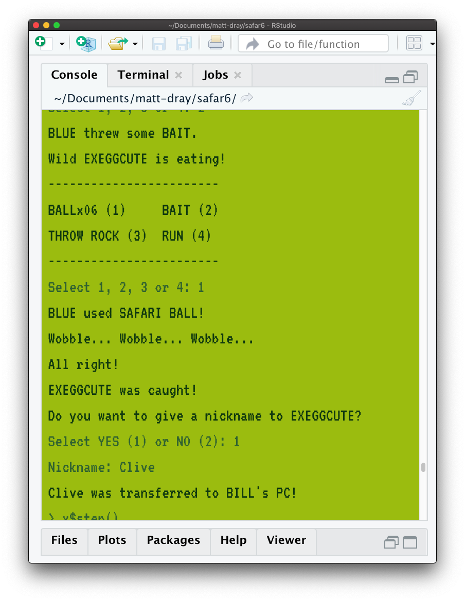

# gamelad

An RStudio theme (rstheme file) limited to the greens of the original Nintendo Game Boy. Created using [the thTheme-Editor app](https://tmtheme-editor.herokuapp.com/) and {rstudioapi}.

To install the theme for RStudio, download it and add it via _Tools_ > _Global options..._ > _Appearance_ > _Add..._

Or you can run:

``` r
theme_url <- 
  "https://raw.githubusercontent.com/matt-dray/gamelad/main/gamelad.rstheme"

rstudioapi::addTheme(theme_url, apply = TRUE)
```

Created originally for RStudio users playing [{safar6}](https://github.com/matt-dray/safar6), an R package that lets you play a simplified, simulated version of [the Safari Zone](https://bulbapedia.bulbagarden.net/wiki/Kanto_Safari_Zone) sub-area from _Pokémon Blue_ in your console. Here it's paired with the VT323, available from [Google Fonts](https://fonts.google.com/specimen/VT323).


